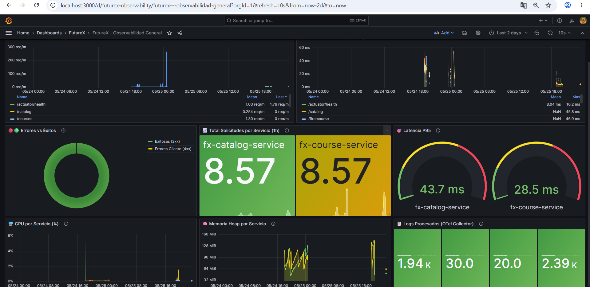
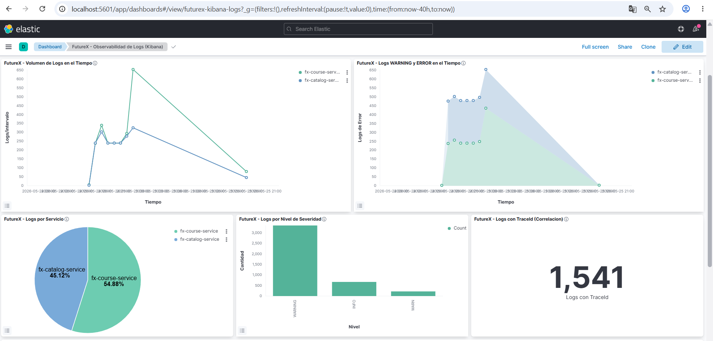
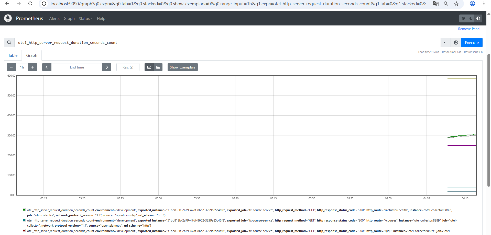

# Observabilidad sobre Microservicios con OpenTelemetry

> **Tipo:** Proyecto de taller académico — Implementación completa de observabilidad  
> **Stack:** Java 17 · Spring Boot 3.3.3 · OpenTelemetry Java Agent · Prometheus · Grafana · Jaeger · ELK  
> **Servicios instrumentados:** `fx-course-service` (puerto 8001) · `fx-catalog-service` (puerto 8002)  
> **Validado:** Mayo 2026

Este repositorio documenta la implementación de una solución de observabilidad completa sobre dos microservicios Java que se comunican entre sí. El objetivo es cubrir los tres pilares de la observabilidad moderna — **trazas distribuidas**, **métricas** y **logs estructurados** — utilizando OpenTelemetry como capa de instrumentación unificada que alimenta múltiples backends especializados, sin dependencia de un proveedor específico (*vendor lock-in*).

---

## Tabla de Contenidos

1. [Arquitectura del Sistema](#1-arquitectura-del-sistema)
2. [Stack Tecnológico](#2-stack-tecnológico)
3. [Puesta en Marcha](#3-puesta-en-marcha)
4. [URLs y Puntos de Acceso](#4-urls-y-puntos-de-acceso)
5. [Trazas Distribuidas — Jaeger](#5-trazas-distribuidas--jaeger)
6. [Métricas — Prometheus](#6-métricas--prometheus)
7. [Dashboards — Grafana](#7-dashboards--grafana)
8. [Logs Estructurados — Kibana y Elasticsearch](#8-logs-estructurados--kibana-y-elasticsearch)
9. [Endpoints de los Microservicios](#9-endpoints-de-los-microservicios)
10. [OpenTelemetry Collector — Pipeline Central](#10-opentelemetry-collector--pipeline-central)
11. [Estrategia de Instrumentación](#11-estrategia-de-instrumentación)
12. [Reglas de Alerta](#12-reglas-de-alerta)
13. [Consultas de Referencia](#13-consultas-de-referencia)
14. [Estructura del Proyecto](#14-estructura-del-proyecto)
15. [Solución de Problemas Comunes](#15-solución-de-problemas-comunes)
16. [Guía de Validación](#16-guía-de-validación)
17. [Resumen de Implementación](#17-resumen-de-implementación)

---

## 1. Arquitectura del Sistema

El sistema está compuesto por dos microservicios Java instrumentados con el OpenTelemetry Java Agent. Toda la señal de telemetría — trazas, métricas y logs — es enviada vía protocolo OTLP a un componente central denominado **OTel Collector**, el cual actúa como pipeline de procesamiento y distribución hacia los backends especializados.

```
┌─────────────────┐     ┌─────────────────┐
│  fx-catalog     │────▶│  fx-course      │
│  service:8002   │     │  service:8001   │──▶ MySQL:3306
└────────┬────────┘     └────────┬────────┘
         │ OTLP (métricas,       │ OTLP (métricas,
         │ trazas, logs)         │ trazas, logs)
         ▼                       ▼
┌─────────────────────────────────────────┐
│     OpenTelemetry Collector             │
│     Puerto host: 4320 (HTTP OTLP)      │
│     Puerto host: 4319 (gRPC OTLP)      │
│     Puerto host: 8889 (Prometheus exp.) │
└──────┬──────────┬──────────────┬────────┘
       │          │              │
       ▼          ▼              ▼
┌──────────┐ ┌──────────┐ ┌────────────┐
│  Jaeger  │ │Prometheus│ │ Archivo    │
│  :16686  │ │  :9090   │ │ (logs.json)│
│ (Trazas) │ │(Métricas)│ └─────┬──────┘
└──────────┘ └────┬─────┘       │
                  │              ▼
                  │    ┌───────────────┐
                  │    │   Logstash    │
                  │    │  (pipeline)   │
                  │    └───────┬───────┘
                  │            │
                  ▼            ▼
           ┌──────────┐ ┌───────────────┐
           │ Grafana  │ │Elasticsearch  │
           │  :3000   │ │   :9200       │
           │(Dashboards│ └───────┬───────┘
           └──────────┘         │
                                ▼
                         ┌───────────────┐
                         │    Kibana     │
                         │    :5601      │
                         │   (Logs UI)   │
                         └───────────────┘
```

### Flujo de datos

1. Los microservicios envían telemetría vía OTLP gRPC al **OTel Collector** (puerto 4317 interno, mapeado al 4319 del host).
2. El Collector procesa y distribuye la señal por tipo:
   - **Trazas** → Jaeger, para almacenamiento y visualización de trazas distribuidas.
   - **Métricas** → Prometheus, que realiza scraping del endpoint `/metrics` expuesto por el Collector en el puerto 8889.
   - **Logs** → Archivo JSON en disco → Logstash parsea e ingesta → Elasticsearch indexa → Kibana visualiza.
3. **Grafana** se conecta a Prometheus, Elasticsearch y Jaeger como fuentes de datos para dashboards unificados.

---

## 2. Stack Tecnológico

| Componente | Tecnología | Versión |
|-----------|-----------|---------|
| Lenguaje | Java | 17+ |
| Framework | Spring Boot | 3.3.3 |
| Base de datos | MySQL | 8.0 |
| Instrumentación | OpenTelemetry Java Agent | 2.27.0 |
| Collector | OpenTelemetry Collector Contrib | 0.88.0 |
| Trazas | Jaeger (all-in-one) | latest |
| Métricas | Prometheus | v2.47.0 |
| Dashboards | Grafana | 10.1.0 |
| Búsqueda de logs | Elasticsearch | 7.17.0 |
| Pipeline de logs | Logstash | 7.17.0 |
| UI de logs | Kibana | 7.17.0 |
| Build | Maven | wrapper incluido |

---

## 3. Puesta en Marcha

### Paso 1 — Levantar la infraestructura

El siguiente comando inicializa los **10 contenedores** del stack: Jaeger, OTel Collector, Prometheus, Grafana, Elasticsearch, Logstash, Kibana, MySQL, `fx-course-service` y `fx-catalog-service`.

```bash
docker compose up -d
```

Estado esperado de los contenedores:
```bash
docker compose ps
# Resultado esperado: todos los servicios en estado Up o Up (healthy)
```

### Paso 2 — Compilar los microservicios

```bash
# Compilar fx-course-service
cd parte0-JaegerCourseApp
./mvnw clean package -DskipTests
cd ..

# Compilar fx-catalog-service
cd part0-JaegerCourseCatalog
./mvnw clean package -DskipTests
cd ..
```

> **Windows:** Usar `.\mvnw.cmd` en lugar de `./mvnw`

### Paso 3: Ejecutar con el Java Agent

> **IMPORTANTE:** Usar puerto **4320** (HTTP OTLP). El puerto 4319 es gRPC y el agent usa HTTP por defecto.

**fx-course-service (puerto 8001):**
```bash
java -javaagent:opentelemetry-javaagent.jar \
     -Dotel.service.name=fx-course-service \
     -Dotel.exporter.otlp.endpoint=http://localhost:4320 \
     -Dotel.metrics.exporter=otlp \
     -Dotel.logs.exporter=otlp \
     -Dotel.traces.exporter=otlp \
     -jar parte0-JaegerCourseApp/target/FutureXCourseApp-0.0.1-SNAPSHOT.jar
```

**fx-catalog-service (puerto 8002):**
```bash
java -javaagent:opentelemetry-javaagent.jar \
     -Dotel.service.name=fx-catalog-service \
     -Dotel.exporter.otlp.endpoint=http://localhost:4320 \
     -Dotel.metrics.exporter=otlp \
     -Dotel.logs.exporter=otlp \
     -Dotel.traces.exporter=otlp \
     -jar part0-JaegerCourseCatalog/target/FutureXCourseCatalog-0.0.1-SNAPSHOT.jar
```

> En PowerShell, cada flag `-D` debe estar entre comillas: `"-Dotel.service.name=fx-course-service"`

### Paso 4 — Generar tráfico de prueba

Los dashboards y métricas requieren tráfico real hacia los microservicios para producir datos observables. Se puede generar de forma manual o mediante el script incluido:

```bash
# Listar todos los cursos
curl http://localhost:8001/courses

# Obtener un curso por ID
curl http://localhost:8001/courses/1

# Catálogo — genera una traza distribuida: fx-catalog-service llama a fx-course-service
curl http://localhost:8002/catalog

# Solicitud que produce un error 404 — útil para validar métricas de error
curl http://localhost:8001/courses/999
```

Alternativamente, mediante el script incluido:
```powershell
powershell -ExecutionPolicy Bypass -File generate-traffic.ps1
```

### Paso 5 — Verificar la telemetría

```powershell
powershell -ExecutionPolicy Bypass -File verify.ps1
```

---

## 4. URLs y Puntos de Acceso

> Se recomienda generar tráfico antes de explorar los dashboards:
> ```powershell
> powershell -ExecutionPolicy Bypass -File generate-traffic-heavy.ps1
> ```

**Herramientas de Observabilidad**

- Jaeger → http://localhost:16686
- Prometheus → http://localhost:9090
- Grafana → http://localhost:3000 *(admin / admin)*
- Kibana → http://localhost:5601
- Elasticsearch → http://localhost:9200

**Grafana — Dashboards**

- Observabilidad General → http://localhost:3000/d/futurex-observability

- Requests por Endpoint → http://localhost:3000/d/futurex-requests-endpoint
- CPU y Memoria → http://localhost:3000/d/futurex-resources
- Errores vs Éxitos → http://localhost:3000/d/futurex-errors-success
- Avanzado / Anomalías → http://localhost:3000/d/futurex-advanced
- Alertas → http://localhost:3000/alerting/list

**Kibana**

- Dashboard principal → 

- Dev Tools → http://localhost:5601/app/dev_tools#/console
- Discover → http://localhost:5601/app/discover
- Index Patterns → http://localhost:5601/app/management/kibana/indexPatterns

**Prometheus**

- Queries PromQL → 

- Targets → http://localhost:9090/targets
- Alertas → http://localhost:9090/alerts
- Métricas raw del Collector → http://localhost:8889/metrics

**Microservicios**

- Cursos (lista) → http://localhost:8001/courses
- Curso por ID → http://localhost:8001/courses/1
- 404 intencional → http://localhost:8001/courses/999
- Catálogo (traza distribuida) → http://localhost:8002/catalog
- Primer curso → http://localhost:8002/firstcourse
- Health course-service → http://localhost:8001/actuator/health
- Health catalog-service → http://localhost:8002/actuator/health

**Elasticsearch (diagnóstico)**

- Estado del cluster → http://localhost:9200
- Índices → http://localhost:9200/_cat/indices?v
- Mapping de logs → http://localhost:9200/otel-logs-*/_mapping
- Logstash monitoring → http://localhost:9600

---

### Tabla de referencia completa

#### Herramientas de Observabilidad

| Herramienta | URL principal | Credenciales | Qué hace |
|-------------|--------------|-------------|----------|
| **Jaeger** | http://localhost:16686 | Sin auth | Trazas distribuidas — spans, waterfall, correlación entre servicios |
| **Prometheus** | http://localhost:9090 | Sin auth | Métricas — queries PromQL, targets activos, alertas |
| **Grafana** | http://localhost:3000 | admin / admin | Dashboards — métricas, alertas, correlación |
| **Kibana** | http://localhost:5601 | Sin auth | Logs — discover, dashboard, saved searches |
| **Elasticsearch** | http://localhost:9200 | Sin auth | API REST de búsqueda de logs (Dev Tools desde Kibana) |

#### Dashboards de Grafana

| Dashboard | URL | Qué muestra |
|-----------|-----|-------------|
| Observabilidad General | http://localhost:3000/d/futurex-observability | Overview: tráfico, latencia, errores, CPU, heap |
| Ejemplo 1: Requests por Endpoint | http://localhost:3000/d/futurex-requests-endpoint | Req/min por endpoint y servicio, método HTTP |
| Ejemplo 2: CPU y Memoria | http://localhost:3000/d/futurex-resources | CPU JVM, heap, threads, GC |
| Ejemplo 3: Errores vs Éxitos | http://localhost:3000/d/futurex-errors-success | Tasa de error %, distribución status codes |
| Avanzado: Anomalías y Correlación | http://localhost:3000/d/futurex-advanced | Anomalías, correlación latencia/errores/CPU, P50/P95/P99 |
| Alertas activas | http://localhost:3000/alerting/list | 5 reglas de alerta configuradas |

#### Dashboards y vistas de Kibana

| Vista | URL | Qué muestra |
|-------|-----|-------------|
| Dashboard principal | http://localhost:5601/app/dashboards#/view/futurex-kibana-logs | 6 paneles: volumen, errores, pie, bar, metric, tabla |
| Discover — Logs con TraceId | http://localhost:5601/app/discover#/?_a=(savedQuery:'futurex-search-traced-logs') | Logs con traceId, columnas preconfiguradas |
| Dev Tools | http://localhost:5601/app/dev_tools#/console | Queries JSON contra Elasticsearch |
| Index Pattern | http://localhost:5601/app/management/kibana/indexPatterns | Ver el index pattern `otel-logs-*` |

#### Vistas de Prometheus

| Vista | URL | Qué muestra |
|-------|-----|-------------|
| Graph (queries PromQL) | http://localhost:9090/graph | Ejecutar cualquier query PromQL |
| Targets activos | http://localhost:9090/targets | Estado del scrape a `otel-collector:8889` |
| Alertas activas | http://localhost:9090/alerts | Estado de las alertas definidas en `prometheus_alert_rules.yml` |
| Métricas raw del Collector | http://localhost:8889/metrics | Endpoint de scrape — todas las métricas en formato Prometheus |

#### Endpoints de los Microservicios

| Servicio | Método | URL | Descripción |
|----------|--------|-----|-------------|
| fx-course-service | GET | http://localhost:8001/courses | Lista todos los cursos (con query MySQL) |
| fx-course-service | GET | http://localhost:8001/courses/1 | Obtiene curso por ID |
| fx-course-service | GET | http://localhost:8001/courses/999 | Genera 404 intencional (prueba de errores) |
| fx-course-service | POST | http://localhost:8001/courses | Crear nuevo curso |
| fx-course-service | GET | http://localhost:8001/actuator/health | Health check |
| fx-catalog-service | GET | http://localhost:8002/catalog | Catálogo completo (llama internamente a course-service → traza distribuida) |
| fx-catalog-service | GET | http://localhost:8002/firstcourse | Primer curso del catálogo |
| fx-catalog-service | GET | http://localhost:8002/actuator/health | Health check |

#### Infraestructura interna (diagnóstico)

| Servicio | URL | Qué muestra |
|----------|-----|-------------|
| Elasticsearch API | http://localhost:9200 | Estado del cluster, índices |
| Elasticsearch índices | http://localhost:9200/_cat/indices?v | Lista de índices incluyendo `otel-logs-*` |
| Elasticsearch mapping | http://localhost:9200/otel-logs-*/_mapping | Campos disponibles en el índice de logs |
| Logstash monitoring | http://localhost:9600 | Estado del pipeline de Logstash |

---

## 5. Trazas Distribuidas — Jaeger

**URL:** http://localhost:16686

### Exploración de trazas

En la interfaz de Jaeger, el campo **Service** permite seleccionar `fx-course-service` o `fx-catalog-service`. Al ejecutar **Find Traces**, el sistema devuelve una lista de trazas con su duración y número de spans. Al acceder a una traza individual se presenta el **diagrama de cascada (waterfall)**, donde:
- Cada barra horizontal representa un **span** (una unidad de operación instrumentada).
- Las trazas originadas en `fx-catalog-service` contienen spans de **ambos servicios**, evidenciando la propagación del contexto en llamadas distribuidas.
- Cada span expone atributos semánticos: `http.method`, `http.route`, `http.response_status_code`.

### Servicios visibles en Jaeger

| Servicio | Descripción |
|----------|-------------|
| `fx-course-service` | Spans de endpoints CRUD de cursos |
| `fx-catalog-service` | Spans del catálogo + llamadas HTTP salientes al servicio de cursos |
| `jaeger-all-in-one` | Spans internos de Jaeger |

### Correlación de trazas con logs

El **Trace ID** de cualquier traza en Jaeger puede utilizarse para recuperar todos los logs asociados a esa solicitud en Kibana mediante el filtro KQL:
```
traceId: "abc123def456..."
```
Esta consulta retorna documentos de ambos microservicios que participaron en la misma traza distribuida, permitiendo correlacionar eventos de log con spans específicos.

---

## 6. Métricas — Prometheus

**URL:** http://localhost:9090

La interfaz de Prometheus expone un editor de consultas PromQL en la pestaña **Graph**. Los resultados pueden visualizarse en modo tabla (valores puntuales) o en modo gráfico (serie temporal). Las métricas disponibles se listan en el endpoint de scraping http://localhost:8889/metrics.

### Consultas de verificación básica

```promql
# Ver todas las métricas HTTP del Java Agent
otel_http_server_request_duration_seconds_count

# Solicitudes por minuto por endpoint
sum(rate(otel_http_server_request_duration_seconds_count[1m])) by (http_route) * 60

# Uso de CPU por servicio (%)
otel_jvm_cpu_recent_utilization_ratio * 100

# Memoria heap usada
sum(otel_jvm_memory_used_bytes{jvm_memory_type="heap"}) by (service_name)

# Tasa de errores 5xx (%)
sum(rate(otel_http_server_request_duration_seconds_count{http_response_status_code=~"5.."}[5m]))
/
sum(rate(otel_http_server_request_duration_seconds_count[5m])) * 100
```

### Estado del scraping

En http://localhost:9090/targets puede verificarse que el target `otel-collector` apuntando a `http://otel-collector:8889/metrics` se encuentra en estado **UP**. Las cinco reglas de alerta configuradas son consultables en http://localhost:9090/alerts.

### Convención de nombres de métricas

| Fuente | Prefijo | Ejemplo |
|--------|---------|---------|
| Java Agent (auto) | `otel_http_server_*`, `otel_jvm_*` | `otel_http_server_request_duration_seconds_count` |
| Métricas custom | `otel_fx_catalog_*`, `otel_fx_course_*` | `otel_fx_catalog_requests_total` |
| Collector interno | `otel_exporter_*`, `otel_receiver_*` | `otel_receiver_accepted_spans_total` |

### Labels importantes

| Label | Descripción | Ejemplo |
|-------|-------------|---------|
| `service_name` | Nombre del microservicio | `fx-catalog-service` |
| `http_route` | Ruta/endpoint HTTP | `/catalog`, `/courses` |
| `http_request_method` | Método HTTP | `GET`, `POST`, `DELETE` |
| `http_response_status_code` | Código de respuesta | `200`, `404`, `500` |

> **Nota:** El Java Agent 2.x usa `http_response_status_code` (NO `http_status_code`)

---

## 7. Dashboards — Grafana

**URL:** http://localhost:3000  
**Credenciales:** admin / admin

Todos los dashboards están provisionados automáticamente al iniciar el contenedor y se encuentran en la carpeta **FutureX** del menú de Dashboards. No se requiere configuración manual.

### Dashboard 1: Observabilidad General

**URL directa:** http://localhost:3000/d/futurex-observability

| Panel | Tipo | Qué muestra |
|-------|------|-------------|
| Solicitudes/min por Endpoint | Timeseries | Tráfico HTTP agrupado por ruta |
| Latencia Promedio (ms) | Timeseries | Tiempo de respuesta por endpoint |
| Errores vs Éxitos | Pie chart (donut) | Distribución 2xx vs 4xx vs 5xx |
| Total Solicitudes (1h) | Stat | Contadores por servicio |
| Latencia P95 | Gauge | Percentil 95 por servicio |
| CPU por Servicio | Timeseries | Uso de CPU JVM |
| Memoria Heap | Timeseries | Memoria JVM usada |
| Logs Recientes | Logs panel | Últimos logs de Elasticsearch |

### Dashboard 2: Solicitudes por Endpoint

**URL directa:** http://localhost:3000/d/futurex-requests-endpoint

| Panel | Tipo | Qué muestra |
|-------|------|-------------|
| Solicitudes/min (Java Agent) | Timeseries | Todas las rutas HTTP auto-instrumentadas |
| Solicitudes/min (Catálogo custom) | Timeseries | Métricas `fx_catalog_requests_total` |
| Solicitudes/min (Cursos custom) | Timeseries | Métricas `fx_course_requests_total` |
| Total por Servicio | Stat | Contadores en la última hora |
| Solicitudes por Método HTTP | Pie chart | GET vs POST vs DELETE |

### Dashboard 3: CPU y Memoria

**URL directa:** http://localhost:3000/d/futurex-resources

| Panel | Tipo | Qué muestra |
|-------|------|-------------|
| CPU por Servicio | Timeseries | Uso de CPU (%) por JVM |
| Memoria Heap | Timeseries | Heap used vs committed |
| Threads JVM | Timeseries | Número de threads activos |
| CPU Actual | Gauge | Uso actual de CPU por servicio |
| Memoria Heap Actual | Gauge | % de heap usado |
| Garbage Collection | Timeseries | Duración de GC por servicio |

### Dashboard 4: Errores vs Éxitos

**URL directa:** http://localhost:3000/d/futurex-errors-success  
**Rango de tiempo por defecto:** Últimas 6 horas

| Panel | Tipo | Qué muestra |
|-------|------|-------------|
| Distribución (6h) | Pie chart (donut) | 2xx (verde) vs 3xx (azul) vs 4xx (naranja) vs 5xx (rojo) |
| Tasa de Error (%) | Timeseries | % de errores en el tiempo |
| Errores vs Éxitos por Servicio | Timeseries | Separado por fx-catalog y fx-course |
| Correlación Error-Latencia | Timeseries (dual axis) | Tasa de error vs latencia P95 |
| Status Codes por Endpoint | Tabla | Conteo por ruta, status y servicio |

### Datasources configurados

| Datasource | Tipo | URL interna | Uso |
|-----------|------|-------------|-----|
| Prometheus | Default | http://prometheus:9090 | Métricas en dashboards |
| Elasticsearch | Logs | http://elasticsearch:9200 | Panel de logs recientes |
| Jaeger | Trazas | http://jaeger:16686 | Exploración de trazas |

---

## 8. Logs Estructurados — Kibana y Elasticsearch

**URL:** http://localhost:5601

El index pattern `otel-logs-*`, las visualizaciones, los saved searches y el dashboard principal están **provisionados automáticamente** mediante la Saved Objects API de Kibana al iniciar el contenedor. No se requiere configuración manual.

### Dashboard principal

**URL:** http://localhost:5601/app/dashboards#/view/futurex-kibana-logs  
**Rango de tiempo por defecto:** Last 3 hours. Contiene 6 paneles:

---

#### Panel 1 — FutureX: Volumen de Logs en el Tiempo *(Line chart)*

Representa la cantidad de logs generados por cada microservicio a lo largo del tiempo, agrupados por intervalos automáticos. El eje X corresponde al tiempo y el eje Y a la cantidad de registros por intervalo. Picos sostenidos indican momentos de alta actividad; una línea plana o ausente puede indicar inactividad del servicio o interrupción en el envío de logs.

**Campos usados:** `@timestamp`, `service.name.keyword`

---

#### Panel 2 — FutureX: Logs WARNING y ERROR en el Tiempo *(Area chart)*

Filtra y visualiza únicamente los registros con nivel `WARNING`, `ERROR` o `WARN`, apilados por servicio a lo largo del tiempo. Un incremento del área coloreada en ausencia de aumento en el volumen total indica un aumento relativo en la tasa de errores. `fx-course-service` produce habitualmente más warnings por las exportaciones de métricas de base de datos.

**Campos usados:** `@timestamp`, `service.name.keyword`, filtro `log.level.keyword:(WARNING OR ERROR OR WARN)`

---

#### Panel 3 — FutureX: Logs por Servicio *(Pie chart)*

Muestra la proporción de logs generados por cada microservicio en el período seleccionado. Una distribución aproximada al 50/50 es indicativa de actividad equilibrada. En condiciones normales de tráfico se observa: `fx-course-service` ≈ 51%, `fx-catalog-service` ≈ 49%. Una asimetría pronunciada puede señalar inactividad en uno de los servicios o una tasa de errores elevada.

**Campos usados:** `service.name.keyword`

---

#### Panel 4 — FutureX: Logs por Nivel de Severidad *(Bar chart)*

Distribuye todos los registros según su nivel de severidad OTLP. El nivel **WARNING** predomina habitualmente; corresponde a advertencias internas del OTel Agent relacionadas con exportación de métricas y no representan errores de negocio. Los registros **INFO** corresponden a eventos de negocio reales de los microservicios (por ejemplo: `"Request received at /courses endpoint - traceId=..."`). La presencia de registros **ERROR** con volumen elevado debe interpretarse como indicador de fallo en la aplicación.

**Campos usados:** `log.level.keyword`

---

#### Panel 5 — FutureX: Logs con TraceId *(Metric)*

Contabiliza el total de registros que contienen un `traceId` válido y no vacío en el período seleccionado. Un valor elevado (p. ej., **834**) confirma que la propagación del contexto de traza es funcional entre los microservicios y el pipeline de logs. Un valor de 0 indica que los servicios no están generando logs o que el traceId no se está propagando correctamente.

**Campos usados:** filtro `traceId:* AND NOT traceId:""`

---

#### Panel 6 — FutureX: Logs con TraceId para Correlación *(Tabla / Saved Search)*

Tabla de registros recientes que poseen `traceId` real. Las columnas están preconfiguradas para facilitar la correlación con Jaeger:

**Columnas disponibles:**

| Columna | Contenido | Ejemplo |
|---------|-----------|---------|
| `Time` | Timestamp legible del log | `May 24, 2026 @ 19:59:55` |
| `@timestamp` | Timestamp ISO del log | `2026-05-25T00:59:55.915Z` |
| `service.name` | Microservicio que generó el log | `fx-course-service` |
| `log.level` | Nivel de severidad | `INFO` |
| `traceId` | ID de la traza distribuida (32 hex) | `c81df297bf4f9ae5c...` |
| `Body` | Mensaje completo del log | `"Request received at /1 endpoint - traceId=c81df297..."` |

**Uso para correlación:** Al copiar el valor de `traceId` de cualquier registro de `fx-catalog-service` y buscarlo en Jaeger, se obtiene la traza distribuida completa con spans de ambos servicios. La misma búsqueda en Kibana (`traceId: "c81df297bf4f9ae5c0801021cb288cf9"`) retorna exactamente dos documentos: uno por cada microservicio participante en la traza.

### Saved Searches provisionados

Accesibles desde **Discover** → ícono de carpeta → Open:

| Nombre | Filtro aplicado |
|--------|----------------|
| `FutureX - Logs con TraceId para Correlacion` | `traceId:*` — registros con traza real |
| `FutureX - Logs WARNING y ERROR` | `log.level.keyword:(WARNING OR ERROR OR WARN)` |

### Exploración libre en Discover

En **Discover**, seleccionando el index pattern `otel-logs-*`, se puede añadir las columnas `service.name`, `log.level`, `Body` y `traceId` para una vista tabular completa. El selector de rango temporal permite ajustar el período de análisis entre "Last 1 hour" y "Last 24 hours".

### Consultas KQL de referencia

```
# Todos los logs INFO con traceId real (correlación con Jaeger)
log.level: INFO AND traceId: *

# Solo errores/warnings
log.level.keyword: (WARNING OR ERROR)

# Logs de un servicio específico
service.name: "fx-catalog-service"

# Logs del endpoint /catalog
Body: "/catalog"

# Logs de un request específico por traceId (pegar desde Jaeger)
traceId: "PEGAR_TRACE_ID_AQUI"

# Requests del endpoint /courses con traceId
service.name: "fx-course-service" AND Body: "/courses" AND traceId: *

# Correlación distribuida: mismo traceId en ambos servicios
traceId: "PEGAR_TRACE_ID_AQUI"
# → Debe retornar 2 documentos: uno de fx-catalog-service y uno de fx-course-service
```

### Campos disponibles en el índice `otel-logs-*`

| Campo | Tipo ES | Descripción | Ejemplo |
|-------|---------|-------------|---------|
| `@timestamp` | `date` | Timestamp del log | `2026-05-25T00:30:00.000Z` |
| `service.name` | `text` + `.keyword` | Microservicio origen | `fx-catalog-service` |
| `log.level` | `text` + `.keyword` | Nivel de severidad | `INFO`, `WARNING` |
| `Body` | `text` | Mensaje del log | `"Request received at /catalog..."` |
| `traceId` | `text` | ID de traza W3C (correlación Jaeger) | `91424f8427c56bbab1...` |
| `spanId` | `text` | ID del span | `abc123...` |
| `severityNumber` | `long` | Nivel numérico OTLP | 9=INFO, 13=WARNING, 17=ERROR |

### Consultas avanzadas mediante Dev Tools

La consola de Kibana Dev Tools (accesible en http://localhost:5601/app/dev_tools#/console) permite ejecutar consultas JSON DSL directamente contra Elasticsearch:

```json
GET otel-logs-*/_search
{
  "size": 10,
  "query": {
    "bool": {
      "must": [
        { "match": { "log.level": "INFO" } },
        { "exists": { "field": "traceId" } }
      ],
      "must_not": [ { "term": { "traceId": "" } } ]
    }
  },
  "sort": [{ "@timestamp": { "order": "desc" } }]
}
```

```json
GET otel-logs-*/_count
{
  "query": {
    "term": { "service.name.keyword": "fx-course-service" }
  }
}
```

---

## 9. Endpoints de los Microservicios

### fx-course-service (puerto 8001)

| Método | Endpoint | Descripción |
|--------|----------|-------------|
| GET | `/courses` | Lista todos los cursos |
| GET | `/courses/{id}` | Obtiene un curso por ID |
| POST | `/courses` | Crea un nuevo curso |
| DELETE | `/courses/{id}` | Elimina un curso |
| GET | `/actuator/health` | Health check |
| GET | `/actuator/metrics` | Métricas de Spring Actuator |

### fx-catalog-service (puerto 8002)

| Método | Endpoint | Descripción |
|--------|----------|-------------|
| GET | `/catalog` | Lista el catálogo completo (llama a fx-course-service) |
| GET | `/firstcourse` | Obtiene el primer curso del catálogo |
| GET | `/` | Endpoint raíz |
| GET | `/actuator/health` | Health check |

### Ejemplos con cURL

```bash
# Listar cursos
curl http://localhost:8001/courses

# Crear un curso
curl -X POST http://localhost:8001/courses \
  -H "Content-Type: application/json" \
  -d '{"courseid":4,"coursename":"Microservices","author":"John"}'

# Catálogo (traza distribuida → fx-catalog llama a fx-course)
curl http://localhost:8002/catalog

# Eliminar un curso
curl -X DELETE http://localhost:8001/courses/4
```

---

## 10. OpenTelemetry Collector — Pipeline Central

### Pipelines configuradas

| Pipeline | Receiver | Processors | Exporters |
|----------|----------|-----------|-----------|
| **Traces** | OTLP (gRPC + HTTP) | memory_limiter, batch | Jaeger (OTLP), logging |
| **Metrics** | OTLP (gRPC + HTTP) | memory_limiter, batch | Prometheus, logging |
| **Logs** | OTLP (gRPC + HTTP) | batch | File (`/var/log/otel-collector.log`), logging |

### Puertos del Collector

| Puerto host | Puerto container | Protocolo | Uso |
|-------------|-----------------|-----------|-----|
| 4320 | 4318 | HTTP OTLP | Endpoint para microservicios ejecutados fuera de Docker |
| 4319 | 4317 | gRPC OTLP | Endpoint gRPC; requiere `-Dotel.exporter.otlp.protocol=grpc` |
| 8889 | 8889 | HTTP | Endpoint de scraping para Prometheus |

> El Java Agent v2.x emplea HTTP como protocolo por defecto. Al ejecutar los microservicios localmente, debe utilizarse el puerto **4320**; en el contexto de Docker Compose los servicios se comunican internamente en el puerto 4317 vía gRPC.

---

## 11. Estrategia de Instrumentación

### Instrumentación automática y manual

La instrumentación combina dos capas complementarias:

1. **Automática — OpenTelemetry Java Agent:** El archivo `opentelemetry-javaagent.jar`, adjunto al proceso Java mediante `-javaagent:`, instrumenta de forma transparente y sin modificación del código fuente:
   - Solicitudes HTTP entrantes y salientes.
   - Consultas JDBC / MySQL.
   - Métricas de la JVM: CPU, memoria heap, threads, garbage collection.
   - Propagación de contexto distribuido según el estándar W3C TraceContext.

2. **Manual — SDK de OpenTelemetry en controllers:** Complementa la instrumentación automática con señal específica del dominio:
   - Contadores de solicitudes: `fx_course_requests_total`, `fx_catalog_requests_total`.
   - Histogramas de duración: `fx_course_request_duration_ms`, `fx_catalog_request_duration_ms`.
   - Spans con atributos semánticos: `endpoint`, `service.name`, `http.method`.
   - Logs estructurados que incluyen `traceId` y `spanId` en cada registro.

### OpenTelemetryConfig.java — Compatibilidad con el Agent

La clase `OpenTelemetryConfig` implementa detección del SDK global en tiempo de ejecución:
- **Con Agent presente:** reutiliza el SDK global ya registrado por el agent, evitando conflictos.
- **Sin Agent:** instancia el SDK manualmente con los exporters OTLP configurados.

---

## 12. Reglas de Alerta

### Alertas en Prometheus

Las cinco reglas están definidas en `prometheus_alert_rules.yml` y son evaluadas continuamente. Su estado (Inactive / Pending / Firing) es consultable en http://localhost:9090/alerts.

| Alerta | Condición | Severidad | Duración |
|--------|-----------|-----------|----------|
| `HighErrorRate` | >10% respuestas 5xx en 5 min | warning | 2 min |
| `HighLatency` | P95 latencia > 2 segundos | critical | 3 min |
| `NoTraffic` | Sin solicitudes HTTP en 10 min | info | 10 min |
| `CatalogHighLatency` | Latencia promedio catálogo > 1s | warning | 2 min |
| `CourseHighLatency` | Latencia promedio cursos > 1s | warning | 2 min |

---

## 13. Consultas de Referencia

> Documentación completa con explicaciones en:
> - [`docs/queries-prometheus.md`](docs/queries-prometheus.md)
> - [`docs/queries-elasticsearch.md`](docs/queries-elasticsearch.md)

---

### Prometheus (PromQL) — 18 queries

Ejecutar en: **http://localhost:9090** → pestaña Graph

| # | Query resumido | Qué muestra | Dónde verlo |
|---|----------------|-------------|-------------|
| 1 | `rate(sum/count)*1000` | Latencia promedio por endpoint (ms) | Prometheus Graph / Grafana panel 2 |
| 2 | `rate(count[1m])*60 by (http_route)` | Solicitudes/min por endpoint | Prometheus Graph / Grafana panel 1 |
| 3 | `rate(count[1m]) by (exported_job)` | Req/s por servicio | Prometheus Graph |
| 4 | `increase([1h])` | Total requests en la última hora | Prometheus Graph / Grafana panel 4 |
| 5 | `5xx / total * 100` | Tasa de errores 5xx (%) | Prometheus Graph / Grafana Errores dashboard |
| 6 | `[45]xx / total * 100` | Tasa de errores 4xx+5xx combinados | Prometheus Graph |
| 7 | `histogram_quantile(0.95)` | Latencia P95 por servicio | Prometheus Graph / Grafana panel 5 |
| 8 | `histogram_quantile(0.99) by (http_route)` | Latencia P99 por endpoint | Prometheus Graph / Grafana Avanzado |
| 9 | `jvm_cpu_recent_utilization * 100` | CPU por servicio (%) | Prometheus Graph / Grafana panel 6 |
| 10 | `jvm_memory_used{heap} by (exported_job)` | Heap usado por servicio | Prometheus Graph / Grafana panel 7 |
| 11 | `heap_used / heap_committed * 100` | % de heap ocupado | Prometheus Graph / Grafana Recursos |
| 12 | `jvm_thread_count` | Threads activos por servicio | Prometheus Graph / Grafana Recursos |
| 13 | `sum(rate(count[1m]))` | Throughput total del sistema | Prometheus Graph |
| 14 | `http_client rate(sum/count)` | Latencia llamadas catalog→course | Prometheus Graph / Grafana Avanzado |
| 15 | `db_client_connections_usage/max` | Pool conexiones MySQL (HikariCP) | Prometheus Graph |
| 16 | `otel_processedLogs_total` etc. | Métricas internas del OTel Collector | Prometheus Graph / Grafana panel 8 |
| 17 | `[45]xx by (http_route, exported_job)` | Errores desglosados por endpoint y servicio | Prometheus Graph |
| 18 | `by catalog` vs `by course` | Comparación de carga entre servicios | Prometheus Graph |

---

### Elasticsearch (JSON DSL + KQL) — 12 queries

Ejecutar en: **http://localhost:5601** → Dev Tools  
O directamente contra: **http://localhost:9200**

| # | Query | Qué muestra | Dónde verlo |
|---|-------|-------------|-------------|
| 1 | `bool should [ERROR, WARNING]` | Logs de error/warning en 24h | Kibana Dev Tools / Discover |
| 2 | `match service.name + range 2h` | Todos los logs de un servicio | Kibana Discover: `service.name: "fx-catalog-service"` |
| 3 | `should [WARNING, WARN]` | Logs de advertencia | Kibana Discover: `log.level: WARNING` |
| 4 | `term traceId: "..."` | Logs de una traza específica (correlación con Jaeger) | Kibana Dev Tools → pegar traceId de Jaeger |
| 5 | `bool must [ERROR + Body: "catalog"]` | Errores de un endpoint específico | Kibana Dev Tools / Discover: `log.level: ERROR AND Body: "/catalog"` |
| 6 | `aggs: terms(service) + date_histogram` | Errores por servicio y por hora | Kibana Dev Tools |
| 7 | `aggs: terms(service) > terms(level)` | Volumen de logs con sub-agrupación por nivel | Kibana Dev Tools / Kibana Dashboard panel |
| 8 | `aggs: terms(level) + histogram(severityNumber)` | Distribución por nivel de severidad | Kibana Dev Tools / Kibana Dashboard pie chart |
| 9 | `range: now-15m` | Logs recientes (verificación en tiempo real) | Kibana Discover → ajustar rango temporal |
| 10 | `match Body + highlight` | Full-text search con resaltado | Kibana Dev Tools / Discover: `Body: "course"` |
| 11 | `exists traceId + must_not traceId:""` | Solo logs de requests HTTP reales | Kibana Discover: `traceId: *` |
| 12 | `date_histogram(1m) > terms(service)` | Timeline logs por minuto por servicio | Kibana Dev Tools / Kibana Dashboard bar chart |

---

### Grafana — 5 dashboards

| Dashboard | URL | Paneles | Qué muestra |
|-----------|-----|---------|-------------|
| Observabilidad General | http://localhost:3000/d/futurex-observability | 8 | Overview completo: tráfico, latencia, errores, CPU, heap, logs |
| Requests por Endpoint | http://localhost:3000/d/futurex-requests-endpoint | 5 | Req/min por endpoint, método HTTP, desglose por servicio |
| CPU y Memoria | http://localhost:3000/d/futurex-resources | 6 | CPU JVM, heap, threads, GC por servicio |
| Errores vs Éxitos | http://localhost:3000/d/futurex-errors-success | 5 | Tasa de error %, distribución status codes, comparativa |
| Avanzado / Anomalías | http://localhost:3000/d/futurex-advanced | 6 | P50/P95/P99, correlación latencia/CPU/errores, anomalías |

---

### Alertas en Prometheus — 5 reglas

Ver estado en: **http://localhost:9090/alerts**  
Disparar manualmente: `powershell -ExecutionPolicy Bypass -File generate-errors.ps1`

| Alerta | Condición | `for` | Severidad |
|--------|-----------|-------|-----------|
| `HighErrorRate` | 4xx+5xx > 10% del total | 2 min | warning |
| `HighLatency` | P95 > 2 segundos | 3 min | critical |
| `NoTraffic` | Sin requests en 10 min | 10 min | info |
| `CatalogHighLatency` | Latencia catalog > 1s promedio | 2 min | warning |
| `CourseHighLatency` | Latencia course > 1s promedio | 2 min | warning |

---

### Kibana — configuración avanzada provisionada

| Componente | Tipo | Dónde verlo |
|------------|------|-------------|
| Dashboard con 6 paneles | Dashboard | http://localhost:5601/app/dashboards#/view/futurex-kibana-logs |
| Volumen de logs en tiempo | Bar chart (por minuto) | Panel 1 del dashboard Kibana |
| Distribución por nivel | Pie chart | Panel 2 del dashboard Kibana |
| Logs por servicio | Bar horizontal | Panel 3 del dashboard Kibana |
| Conteo total de logs | Metric | Panel 4 del dashboard Kibana |
| Tabla últimos logs | Data table | Panel 5/6 del dashboard Kibana |
| Saved search con traceId | Discover | Menú → Discover → Open → `FutureX - Logs con TraceId` |
| Index pattern `otel-logs-*` | Management | http://localhost:5601/app/management/kibana/indexPatterns |

---

### Dónde ver cada cosa

| Quiero ver... | Herramienta | URL directa |
|---------------|-------------|-------------|
| Trazas distribuidas completas con spans y waterfall | **Jaeger** | http://localhost:16686 |
| Latencia P95, CPU, heap en tiempo real | **Grafana** | http://localhost:3000/d/futurex-observability |
| Tasa de errores por endpoint | **Grafana** | http://localhost:3000/d/futurex-errors-success |
| Comparar carga entre servicios | **Grafana** | http://localhost:3000/d/futurex-requests-endpoint |
| GC, threads, pool de conexiones | **Grafana** | http://localhost:3000/d/futurex-resources |
| Anomalías y correlación avanzada | **Grafana** | http://localhost:3000/d/futurex-advanced |
| Estado de las alertas | **Prometheus** | http://localhost:9090/alerts |
| Métricas raw del Collector | **Prometheus** | http://localhost:8889/metrics |
| Logs de error de un servicio | **Kibana** | http://localhost:5601/app/discover → `log.level: ERROR` |
| Logs asociados a una traza | **Kibana** | Dev Tools → query 4 con traceId de Jaeger |
| Distribución de logs por nivel | **Kibana** | http://localhost:5601/app/dashboards#/view/futurex-kibana-logs |
| Todos los logs en tiempo real | **Kibana** | Discover → rango "Last 15 minutes" |
| Estado del cluster Elasticsearch | **Elasticsearch** | http://localhost:9200/_cat/indices?v |
| Correlación log ↔ traza | **Jaeger + Kibana** | Jaeger: copiar traceId → Kibana Discover: `traceId: "VALOR"` |

---

## 14. Estructura del Proyecto

```
OpenTelemetry/
├── docker-compose.yml                  # 8 contenedores de infraestructura
├── otel-collector-config.yaml          # Pipelines: traces→Jaeger, metrics→Prometheus, logs→archivo
├── prometheus.yml                      # Scrape config: otel-collector:8889
├── prometheus_alert_rules.yml          # 5 reglas de alerta
├── logstash.conf                       # Lee JSON OTLP → parsea → Elasticsearch
├── opentelemetry-javaagent.jar         # Agent v2.27.0 para instrumentación automática
├── generate-traffic.ps1                # Script para generar tráfico de prueba
├── verify.ps1                          # Script para verificar que todo funciona
├── logs/.gitkeep                       # Volumen compartido OTel Collector → Logstash
│
├── grafana/
│   ├── provisioning/
│   │   ├── datasources/datasources.yml         # Prometheus + Elasticsearch + Jaeger
│   │   └── dashboards/dashboards.yml           # Auto-carga dashboards al iniciar
│   └── dashboards/
│       ├── futurex-observability.json           # Dashboard principal (8 paneles)
│       ├── futurex-requests-per-endpoint.json   # Dashboard 1: Requests (5 paneles)
│       ├── futurex-resources.json               # Dashboard 2: CPU/Mem (6 paneles)
│       └── futurex-errors-vs-success.json       # Dashboard 3: Errores (5 paneles)
│
├── docs/
│   ├── queries-prometheus.md           # 16 queries PromQL documentados
│   └── queries-elasticsearch.md        # 10 queries Elasticsearch documentados
│
├── parte0-JaegerCourseApp/             # fx-course-service (puerto 8001)
│   ├── pom.xml                         # OTel SDK + Actuator + Micrometer
│   └── src/main/
│       ├── java/.../
│       │   ├── CourseController.java           # CRUD + métricas custom + spans + logging
│       │   ├── OpenTelemetryConfig.java        # SDK config (compatible con Agent)
│       │   ├── Course.java                     # Entidad JPA
│       │   ├── CourseRepository.java           # Spring Data repository
│       │   └── DataLoader.java                 # Carga datos iniciales
│       └── resources/
│           ├── application.properties          # Puerto 8001, MySQL, OTLP config
│           └── logback-spring.xml              # Appender OTLP para logs
│
└── part0-JaegerCourseCatalog/          # fx-catalog-service (puerto 8002)
    ├── pom.xml                         # OTel SDK + Actuator + Micrometer
    └── src/main/
        ├── java/.../
        │   ├── CatalogController.java          # Llama a course-service + métricas + spans
        │   ├── OpenTelemetryConfig.java        # SDK config (compatible con Agent)
        │   └── RestTemplateConfig.java         # RestTemplate con OTel interceptor
        └── resources/
            ├── application.properties          # Puerto 8002, OTLP config
            └── logback-spring.xml              # Appender OTLP para logs
```

---

## 15. Solución de Problemas Comunes

### El OTel Collector no inicia
```bash
docker logs otel-collector --tail 20
```
- Error `permission denied`: el Collector requiere `user: "0:0"` en el `docker-compose.yml` (ya incluido en la configuración del repositorio).
- Error `failed to build pipelines`: revisar la sintaxis de `otel-collector-config.yaml`.

### Métricas ausentes en Prometheus
1. Verificar el estado del target en http://localhost:9090/targets — debe aparecer **UP**.
2. Confirmar que el endpoint de scraping responde: `curl http://localhost:8889/metrics`.
3. Las métricas pueden tardar hasta 30 segundos en aparecer tras la primera solicitud al microservicio.

### Trazas ausentes en Jaeger
1. Verificar que el microservicio apunta al puerto correcto del Collector (4319 para gRPC, 4320 para HTTP).
2. Revisar la salida del microservicio por mensajes `Failed to export spans`.
3. En PowerShell, los flags `-D` deben estar entre comillas dobles.

### Logs ausentes en Kibana/Elasticsearch
1. Verificar el estado de Logstash: `docker logs logstash --tail 20`.
2. Confirmar que el archivo de logs existe: `docker exec otel-collector ls -la /var/log/`.
3. Verificar la existencia del índice: `curl http://localhost:9200/_cat/indices?v`.
4. Si el índice no existe, los microservicios no han emitido logs aún.

### Error `GlobalOpenTelemetry has already been set`
`OpenTelemetryConfig.java` gestiona este caso automáticamente. Si el error persiste, verificar que no exista otra clase registrando un SDK global en el contexto de Spring.

### Warning `ResourceAttributes.SERVICE_NAME is deprecated`
Advertencia cosmética del SDK de OpenTelemetry. No afecta a la funcionalidad ni a la exportación de telemetría.

---

## Notas de Operación

- Los **5 dashboards de Grafana** y las **5 reglas de alerta** se provisionan automáticamente al iniciar el contenedor.
- El **index pattern y dashboard de Kibana** se crean mediante la Saved Objects API en el primer arranque.
- La **correlación entre logs y trazas** se realiza a través del campo `traceId`, presente en ambos sistemas con el mismo valor.
- Para que los paneles de Grafana muestren datos representativos, se recomienda generar un volumen mínimo de tráfico mediante `generate-traffic-heavy.ps1`.

---

## 16. Guía de Validación

Esta sección describe el procedimiento de verificación integral para confirmar el correcto funcionamiento de cada componente del stack desde un estado inicial limpio.

---

### Fase 1 — Infraestructura

Verificar que todos los contenedores se encuentran en ejecución y en estado saludable.

#### Paso 1.1 — Levantar los contenedores

```bash
docker compose up -d
```

#### Paso 1.2 — Verificar el estado

```bash
docker compose ps
```

**Resultado esperado:** Todos los servicios en estado `Up` o `Up (healthy)`.

| Contenedor | Estado esperado |
|------------|----------------|
| `jaeger` | `Up (healthy)` |
| `prometheus` | `Up (healthy)` |
| `elasticsearch` | `Up (healthy)` |
| `kibana` | `Up (healthy)` |
| `futurex-mysql` | `Up (healthy)` |
| `grafana` | `Up` |
| `logstash` | `Up` |
| `otel-collector` | `Up` |

#### Paso 1.3 — Verificar el OTel Collector

```bash
docker logs otel-collector --tail 5
```

**Salida esperada:**
```
Everything is ready. Begin running and processing data.
```

---

### Fase 2 — Microservicios

#### Paso 2.1 — Compilar los microservicios

```bash
# Windows PowerShell
# Course service
cd parte0-JaegerCourseApp; .\mvnw.cmd clean package -DskipTests; cd ..

# Catalog service
cd part0-JaegerCourseCatalog; .\mvnw.cmd clean package -DskipTests; cd ..
```

#### Paso 2.2 — Iniciar fx-course-service

Ejecutar en una terminal independiente:

```bash
# Linux / macOS
java -javaagent:opentelemetry-javaagent.jar \
     -Dotel.service.name=fx-course-service \
     -Dotel.exporter.otlp.endpoint=http://localhost:4320 \
     -Dotel.metrics.exporter=otlp \
     -Dotel.logs.exporter=otlp \
     -Dotel.traces.exporter=otlp \
     -jar parte0-JaegerCourseApp/target/FutureXCourseApp-0.0.1-SNAPSHOT.jar
```

```powershell
# Windows PowerShell
java "-javaagent:opentelemetry-javaagent.jar" `
     "-Dotel.service.name=fx-course-service" `
     "-Dotel.exporter.otlp.endpoint=http://localhost:4320" `
     "-Dotel.metrics.exporter=otlp" `
     "-Dotel.logs.exporter=otlp" `
     "-Dotel.traces.exporter=otlp" `
     -jar "parte0-JaegerCourseApp\target\FutureXCourseApp-0.0.1-SNAPSHOT.jar"
```

**Salida esperada:**
```
[otel.javaagent] opentelemetry-javaagent - version: 2.27.0
Started FutureXCourseAppApplication in XX seconds
Sample courses loaded successfully.
```

#### Paso 2.3 — Iniciar fx-catalog-service

Ejecutar en una segunda terminal independiente:

```bash
# Linux / macOS
java -javaagent:opentelemetry-javaagent.jar \
     -Dotel.service.name=fx-catalog-service \
     -Dotel.exporter.otlp.endpoint=http://localhost:4320 \
     -Dotel.metrics.exporter=otlp \
     -Dotel.logs.exporter=otlp \
     -Dotel.traces.exporter=otlp \
     -jar part0-JaegerCourseCatalog/target/FutureXCourseCatalog-0.0.1-SNAPSHOT.jar
```

```powershell
# Windows PowerShell
java "-javaagent:opentelemetry-javaagent.jar" `
     "-Dotel.service.name=fx-catalog-service" `
     "-Dotel.exporter.otlp.endpoint=http://localhost:4320" `
     "-Dotel.metrics.exporter=otlp" `
     "-Dotel.logs.exporter=otlp" `
     "-Dotel.traces.exporter=otlp" `
     -jar "part0-JaegerCourseCatalog\target\FutureXCourseCatalog-0.0.1-SNAPSHOT.jar"
```

**Salida esperada:**
```
[otel.javaagent] opentelemetry-javaagent - version: 2.27.0
the agent provides the global OpenTelemetry object used by your application.
Started FutureXCourseCatalogApplication in XX seconds
```

#### Paso 2.4 — Verificar health checks

```bash
curl http://localhost:8001/actuator/health
curl http://localhost:8002/actuator/health
```

**Respuesta esperada:** `{"status":"UP",...}`

---

### Fase 3 — Generación de Tráfico

Es necesario generar solicitudes reales hacia los microservicios para que el pipeline de telemetría produzca datos observables en los distintos backends.

#### Opción A — Script automático

```powershell
powershell -ExecutionPolicy Bypass -File generate-traffic.ps1
```

#### Opción B — Requests manuales

```bash
# 1. Listar cursos (genera traza en fx-course-service)
curl http://localhost:8001/courses

# 2. Ver un curso por ID
curl http://localhost:8001/courses/1
curl http://localhost:8001/courses/2

# 3. Catálogo (genera traza DISTRIBUIDA: catalog → course)
curl http://localhost:8002/catalog
curl http://localhost:8002/firstcourse

# 4. Provocar un error 404 (para ver métricas de error)
curl http://localhost:8001/courses/999

# 5. Crear y eliminar un curso (POST y DELETE)
curl -X POST http://localhost:8001/courses \
  -H "Content-Type: application/json" \
  -d '{"courseid":10,"coursename":"Test","author":"Tester"}'
curl -X DELETE http://localhost:8001/courses/10
```

> Tras la generación de tráfico, es recomendable aguardar entre 20 y 30 segundos para que los datos sean procesados y visibles en los sistemas de observabilidad.

---

### Fase 4 — Verificación en Jaeger

**URL:** http://localhost:16686

En el campo **Service** se selecciona `fx-catalog-service` y se ejecuta **Find Traces**. Las trazas resultantes deben presentar spans pertenecientes a ambos servicios, evidenciando la propagación del contexto distribuido. Seleccionando `fx-course-service` se visualizan las trazas individuales de los endpoints `/courses` y `/courses/{id}`. El Trace ID de cualquier traza puede copiarse para su uso posterior en Kibana.

**Indicadores de correcto funcionamiento:**
- Al menos dos servicios disponibles en el selector de servicio.
- Trazas de `fx-catalog-service` con spans salientes hacia `fx-course-service`.
- Atributos semánticos visibles en cada span: `http.method`, `http.route`, `http.response_status_code`.

---

### Fase 5 — Verificación en Prometheus

**URL:** http://localhost:9090

#### 5.1 — Estado del target

En http://localhost:9090/targets el target `otel-collector` debe aparecer en estado **UP**.

#### 5.2 — Métricas HTTP

```promql
otel_http_server_request_duration_seconds_count
```

La consulta debe retornar series con los labels `http_route`, `exported_job` y `http_response_status_code` con valores mayores a cero.

#### 5.3 — Métricas JVM

```promql
otel_jvm_cpu_recent_utilization_ratio
```

Deben existir series para `fx-course-service` y `fx-catalog-service`.

#### 5.4 — Reglas de alerta

En http://localhost:9090/alerts las cinco reglas deben encontrarse en estado **Inactive** o **Pending** bajo condiciones de tráfico normal.

---

### Fase 6 — Verificación en Grafana

**URL:** http://localhost:3000 · **Credenciales:** admin / admin

Los cinco dashboards son accesibles desde **Dashboards → carpeta FutureX**. Cada panel debe presentar datos en el rango temporal activo. Si los paneles muestran "No data", se recomienda ajustar el selector de tiempo a **Last 15 minutes** o **Last 1 hour** y forzar la actualización.

| Dashboard | URL | Criterio de validación |
|-----------|-----|------------------------|
| Observabilidad General | http://localhost:3000/d/futurex-observability | Series temporales con datos en el panel de solicitudes/min |
| Requests por Endpoint | http://localhost:3000/d/futurex-requests-endpoint | Barras de requests desglosadas por endpoint |
| CPU y Memoria | http://localhost:3000/d/futurex-resources | Gráficos de CPU y heap no vacíos |
| Errores vs Éxitos | http://localhost:3000/d/futurex-errors-success | Gráfico de dona con distribución de códigos HTTP |

---

### Fase 7 — Verificación en Kibana

**URL:** http://localhost:5601

El index pattern y el dashboard están provisionados automáticamente y no requieren configuración manual.

#### 7.1 — Dashboard de logs

Acceder a http://localhost:5601/app/dashboards#/view/futurex-kibana-logs. El dashboard debe presentar 6 paneles con datos:

- *Line chart:* volumen de logs por servicio en el tiempo.
- *Area chart:* registros de nivel WARNING y ERROR en el tiempo.
- *Pie chart:* proporción de logs por servicio.
- *Bar chart:* distribución por nivel de severidad OTLP.
- *Metric:* conteo total de registros con `traceId` real.
- *Tabla:* registros recientes con columnas `traceId`, `service.name` y `Body`.

#### 7.2 — Saved Searches en Discover

Desde **Discover → Open**, seleccionar `FutureX - Logs con TraceId para Correlacion`. Las columnas `@timestamp`, `service.name`, `log.level`, `traceId` y `Body` deben estar visibles.

#### 7.3 — Filtrado por nivel de severidad

```
log.level.keyword: (WARNING OR ERROR)
```

#### 7.4 — Correlación con Jaeger

Copiar el Trace ID de cualquier traza en Jaeger y ejecutar la siguiente consulta en Kibana Discover (index `otel-logs-*`):

```
traceId: "PEGAR_TRACE_ID_AQUI"
```

Deben retornarse exactamente dos documentos: uno de `fx-catalog-service` y otro de `fx-course-service`, correspondientes a la misma traza distribuida.

---

### Fase 8 — Verificación Automática

El script `verify.ps1` realiza la verificación integral de todos los sistemas de forma secuencial:

```powershell
powershell -ExecutionPolicy Bypass -File verify.ps1
```

**Salida esperada:**
```
=== 1. JAEGER - Traces ===
Services found: 3
  - fx-catalog-service
  - fx-course-service
  - jaeger-all-in-one

=== 2. PROMETHEUS - Metrics ===
Metric series found: N
  - service=fx-... route=/catalog value=X

=== 3. PROMETHEUS - JVM Metrics ===
JVM CPU series: 4

=== 4. ELASTICSEARCH - Logs ===
Log documents indexed: N  (debe ser > 0)

=== 5. GRAFANA - Dashboards ===
Dashboards found: 5
  - FutureX - Ejemplo 1: ...
  - FutureX - Ejemplo 2: ...
  - FutureX - Ejemplo 3: ...
  - FutureX - Observabilidad General
```

---

### Tabla de verificación consolidada

| # | Sistema | URL | Criterio de validación |
|---|---------|-----|------------------------|
| 1 | Infraestructura | `docker compose ps` | Todos los contenedores en estado `Up` |
| 2 | OTel Collector | `docker logs otel-collector` | `Everything is ready. Begin running and processing data.` |
| 3 | Microservicios | http://localhost:8001/actuator/health | Respuesta `{"status":"UP"}` |
| 4 | **Jaeger** | http://localhost:16686 | Dos servicios instrumentados con trazas distribuidas |
| 5 | **Prometheus** | http://localhost:9090/targets | Target `otel-collector` en estado **UP** |
| 6 | **Grafana** | http://localhost:3000 | Cinco dashboards con datos en todos sus paneles |
| 7 | **Kibana** | http://localhost:5601 | Registros indexados en `otel-logs-*` con `traceId` presente |
| 8 | Script | `verify.ps1` | Todos los verificadores con resultado positivo |

---

## 17. Resumen de Implementación

> **Estado validado:** 25 Mayo 2026 — Verificación integral completada con datos reales.

### Componentes implementados

| Componente | Descripción |
|-----------|-------------|
| **OTel Collector** | Recibe trazas/métricas/logs via OTLP HTTP (4318) y gRPC (4317). Exporta a Jaeger, Prometheus y archivo de logs |
| **Java Agent 2.27.0** | Instrumentación automática de ambos microservicios. Genera métricas JVM, HTTP y DB sin código adicional |
| **Prometheus** | Scrapea métricas del Collector en puerto 8889. Label clave: `exported_job` (no `service_name`) |
| **Grafana** | 5 dashboards + 5 alertas provisionados automáticamente |
| **Jaeger** | Recibe trazas via OTLP gRPC. 3 servicios instrumentados |
| **ELK Stack** | Logstash lee `/var/log/otel-collector.log`, parsea JSON y envía a Elasticsearch. Kibana visualiza |

---

### Descripción de los dashboards de Grafana

#### Dashboard 1 — Solicitudes por Endpoint
**URL:** http://localhost:3000/d/futurex-requests-endpoint

| Panel | Tipo | Contenido | Interpretación |
|-------|------|-----------|----------------|
| Solicitudes/min por Endpoint | Timeseries | Req/min para cada ruta HTTP (`/courses`, `/catalog`, `/firstcourse`, etc.) | Picos sostenidos indican tráfico intenso; ausencia de líneas, inactividad. |
| Solicitudes/min fx-catalog-service | Timeseries | Req/min de `fx-catalog-service` desglosado por endpoint | Permite comparar la carga entre `/catalog` y `/firstcourse`. |
| Solicitudes/min fx-course-service | Timeseries | Req/min de `fx-course-service` desglosado por endpoint | Permite comparar `/courses`, `/{id}` y solicitudes con error 404. |
| Solicitudes Totales por Servicio (1h) | Stat | Total acumulado de solicitudes en la última hora por servicio | Indicador absoluto de carga útil para dimensionamiento. |
| Solicitudes por Método HTTP | Piechart | Distribución GET / POST / DELETE | Refleja el perfil de uso del API. |

**Métrica usada:** `otel_http_server_request_duration_seconds_count` con label `http_route`, `exported_job`, `http_request_method`

---

#### Dashboard 2 — CPU y Memoria
**URL:** http://localhost:3000/d/futurex-resources

| Panel | Tipo | Contenido | Interpretación |
|-------|------|-----------|----------------|
| Uso de CPU por Servicio | Timeseries | CPU JVM (0–100%) por servicio en el tiempo | Uso sostenido >80% indica sobrecarga; picos breves son esperables. |
| Uso de Memoria JVM (Heap) | Timeseries | Heap utilizado en MB por servicio | Crecimiento continuo sin descensos puede indicar memory leak; los descensos corresponden a ciclos de GC. |
| Threads JVM por Servicio | Timeseries | Número de threads activos por JVM | Crecimiento indefinido puede indicar un thread leak. Rango normal: 20–60 threads. |
| CPU Actual (Gauge) | Gauge | Uso instantáneo de CPU con semáforo | Verde <50%, Amarillo <80%, Rojo >80%. |
| Memoria Heap Actual (Gauge) | Gauge | Proporción heap used/committed instantánea | Verde <70%, Amarillo <85%, Rojo >85%. |
| Garbage Collection — Duración | Timeseries | Tiempo acumulado de GC en milisegundos | Picos de GC deben correlacionarse con incrementos de latencia. |

**Métricas usadas:** `otel_jvm_cpu_recent_utilization_ratio`, `otel_jvm_memory_used_bytes`, `otel_jvm_thread_count`, `otel_jvm_gc_duration_seconds`

---

#### Dashboard 3 — Errores vs Éxitos
**URL:** http://localhost:3000/d/futurex-errors-success

| Panel | Tipo | Contenido | Interpretación |
|-------|------|-----------|----------------|
| Distribución de códigos HTTP (6h) | Piechart | Proporción 2xx / 3xx / 4xx / 5xx en las últimas 6 horas | Verde: respuestas exitosas; naranja: errores de cliente; rojo: errores de servidor. |
| Tasa de Error (%) en el tiempo | Timeseries | Porcentaje de solicitudes con código 4xx+5xx sobre el total | Una tasa sostenida >5% merece investigación. Los 404 de `/courses/999` son visibles aquí. |
| Errores vs Éxitos por Servicio | Timeseries | Solicitudes correctas vs erróneas desglosadas por servicio | Permite identificar si los errores se concentran en un servicio específico. |
| Correlación: Errores vs Latencia | Timeseries (eje dual) | Tasa de error % (eje izquierdo) y latencia P95 en ms (eje derecho) | Incremento conjunto indica sobrecarga; incremento aislado de errores sugiere fallos lógicos (validaciones, 404). |
| Códigos HTTP por Endpoint (6h) | Tabla | Recuento de solicitudes por endpoint y código de respuesta | Permite identificar los endpoints con mayor tasa de error. |

**Métricas usadas:** `otel_http_server_request_duration_seconds_count` con `http_response_status_code`

---

#### Dashboard 4 — Observabilidad General
**URL:** http://localhost:3000/d/futurex-observability

| Panel | Tipo | Contenido | Interpretación |
|-------|------|-----------|----------------|
| Solicitudes/min por Endpoint | Timeseries | Vista global de tráfico por ruta HTTP | Visión general de actividad en el sistema. |
| Latencia Promedio por Endpoint (ms) | Timeseries | Latencia media por ruta en ventana de 5 min | Valores sostenidos >500 ms indican degradación; rango normal: <100 ms. |
| Distribución de códigos HTTP | Piechart | Proporción global de códigos de respuesta | En operación normal, el segmento 2xx debe superar el 95%. |
| Total Solicitudes por Servicio (1h) | Stat | Solicitudes acumuladas por servicio en la última hora | Permite comparar la carga relativa entre servicios. |
| Latencia P95 | Gauge | Percentil 95 de latencia global | Verde <500 ms, amarillo <2 000 ms, rojo >2 000 ms. |
| CPU por Servicio (%) | Timeseries | Uso de CPU JVM de ambos servicios | Detección inmediata de condiciones de sobrecarga. |
| Memoria Heap por Servicio | Timeseries | Heap utilizado en MB por servicio | Detección inmediata de presión de memoria. |

**Métricas usadas:** combinación de HTTP server, JVM CPU y Heap

---

#### Dashboard 5 — Análisis Avanzado y Correlación
**URL:** http://localhost:3000/d/futurex-advanced

| Panel | Tipo | Contenido | Interpretación |
|-------|------|-----------|----------------|
| Detección de Anomalías — Tasa de Error | Timeseries | Tasa de error con umbrales visuales al 5% (naranja) y 10% (rojo) | Superación de umbrales indica comportamiento anómalo. Los errores 404 generados en `/courses/999` son identificables. |
| Correlación: Latencia P95 vs Tasa de Error | Timeseries (eje dual) | P95 en ms (eje izquierdo) y tasa de error % (eje derecho) | Incremento conjunto indica sobrecarga del sistema; incremento aislado de la tasa de error sugiere fallos lógicos. |
| Correlación: CPU JVM vs Latencia | Timeseries (eje dual) | CPU % por servicio (izquierdo) y latencia media en ms (derecho) | CPU elevado con latencia alta es indicativo de cuello de botella en la JVM. |
| Throughput por Endpoint (req/min) | Bargauge horizontal | Req/min por endpoint ordenados de mayor a menor | Permite identificar los endpoints con mayor carga de trabajo. |
| Latencia P50 / P95 / P99 | Timeseries | Tres percentiles representados en el mismo panel | Una diferencia pronunciada entre P99 y P50 indica alta variabilidad y presencia de tail latency. |
| Correlación: Heap JVM vs Throughput | Timeseries (eje dual) | Heap en MB (izquierdo) y req/min (derecho) | Crecimiento de heap proporcional al throughput es comportamiento normal; crecimiento desligado del throughput puede indicar memory leak. |
| Tabla: Métricas por Endpoint | Tabla | Req/min, servicio y código HTTP instantáneos por endpoint | Vista tabular para identificación rápida de endpoints problemáticos. |
| Comparación: Catálogo vs Cursos | Timeseries | Req/min de cada servicio en el tiempo | Una divergencia sostenida entre ambas líneas puede indicar degradación en uno de los servicios. |
| Estado Actual del Sistema | Stat con semáforo | Cuatro métricas simultáneas: Error Rate %, P95 ms, CPU máx %, Heap % | Vista instantánea del estado de salud; verde: normal, amarillo: advertencia, rojo: crítico. |
| Conexiones DB: Activas vs Idle | Timeseries | Pool HikariCP de `fx-course-service`: used / idle / max | Valores `used` próximos a `max` indican saturación del pool de conexiones a base de datos. |
| Threads JVM por Servicio | Timeseries | Threads activos en ambas JVMs | Crecimiento indefinido sin estabilización es indicativo de thread leak. |

**Métricas usadas:** todas las `otel_*` disponibles incluyendo histograma, JVM, DB pool

**URLs directas:**
- http://localhost:3000/d/futurex-requests-endpoint
- http://localhost:3000/d/futurex-resources
- http://localhost:3000/d/futurex-errors-success
- http://localhost:3000/d/futurex-observability
- http://localhost:3000/d/futurex-advanced

---

### Reglas de alerta en Grafana

Accesibles en http://localhost:3000/alerting/list.

| UID | Título | Condición de disparo | Severidad |
|-----|--------|-----------------------|-----------|
| `fx-high-error-rate` | Alta Tasa de Errores HTTP | Error rate > 10% durante 2 min | warning |
| `fx-high-latency` | Alta Latencia P95 | P95 > 2 000 ms durante 3 min | critical |
| `fx-no-traffic` | Sin Tráfico HTTP | Tasa < 0.001 req/s durante 10 min | info |
| `fx-high-cpu` | CPU Elevado | CPU JVM > 85% durante 2 min | warning |
| `fx-heap-pressure` | Presión de Memoria Heap | Heap > 90% del committed durante 5 min | critical |

---

### Consultas PromQL de referencia (label: `exported_job`)

```promql
# Requests por minuto por servicio
sum(rate(otel_http_server_request_duration_seconds_count[1m])) by (exported_job) * 60

# Latencia promedio en ms
rate(otel_http_server_request_duration_seconds_sum[5m]) / rate(otel_http_server_request_duration_seconds_count[5m]) * 1000

# Tasa de errores %
(sum(rate(otel_http_server_request_duration_seconds_count{http_response_status_code=~"[45].."}[5m])) / sum(rate(otel_http_server_request_duration_seconds_count[5m]))) * 100

# Latencia P95
histogram_quantile(0.95, sum(rate(otel_http_server_request_duration_seconds_bucket[5m])) by (le, exported_job))

# CPU por servicio
otel_jvm_cpu_recent_utilization_ratio{exported_job="fx-catalog-service"} * 100

# Heap usado por servicio
sum(otel_jvm_memory_used_bytes{jvm_memory_type="heap"}) by (exported_job)
```

> Referencia completa: [`docs/queries-prometheus.md`](docs/queries-prometheus.md) — 18 consultas validadas.

---

### Consultas Elasticsearch de referencia (index: `otel-logs-*`)

```json
// Errores últimas 24h (KQL en Kibana Discover)
log.level: ERROR OR log.level: WARNING

// Logs de un servicio
service.name: "fx-course-service"

// Correlación por traceId
traceId: "PEGAR_ID_DE_JAEGER"

// Logs con traza (requests reales)
traceId: *
```

> Referencia completa: [`docs/queries-elasticsearch.md`](docs/queries-elasticsearch.md) — 12 consultas validadas.

---

### Procedimiento de inicio del proyecto

```powershell
# 1. Levantar infraestructura
docker compose up -d

# 2. Iniciar microservicios (en terminales separadas)
java -javaagent:opentelemetry-javaagent.jar `
  -Dotel.service.name=fx-course-service `
  -Dotel.exporter.otlp.endpoint=http://localhost:4318 `
  -jar parte0-JaegerCourseApp\target\FutureXCourseApp-0.0.1-SNAPSHOT.jar

java -javaagent:opentelemetry-javaagent.jar `
  -Dotel.service.name=fx-catalog-service `
  -Dotel.exporter.otlp.endpoint=http://localhost:4318 `
  -jar parte0-CatalogApp\target\FutureXCatalogApp-0.0.1-SNAPSHOT.jar

# 3. Generar tráfico
powershell -File generate-traffic-heavy.ps1

# 4. Verificar todo
powershell -File final-verify.ps1
```

---

### URLs de acceso

| Herramienta | URL | Credenciales |
|-------------|-----|--------------|
| **Jaeger** (trazas) | http://localhost:16686 | — |
| **Prometheus** (métricas) | http://localhost:9090 | — |
| **Grafana** (dashboards) | http://localhost:3000 | admin / admin |
| **Kibana** (logs) | http://localhost:5601 | — |
| **Elasticsearch** (API) | http://localhost:9200 | — |
| **fx-course-service** | http://localhost:8001 | — |
| **fx-catalog-service** | http://localhost:8002 | — |
| **OTel Collector metrics** | http://localhost:8889/metrics | — |

---

### Guía de navegación por herramienta

**Jaeger** — http://localhost:16686
- Selector **Service:** `fx-course-service` o `fx-catalog-service`.
- Operaciones instrumentadas: `GET /courses`, `GET /catalog`, `GET /{id}`.
- Las trazas de `fx-catalog-service` incluyen spans anidados hacia `fx-course-service`.

**Prometheus** — http://localhost:9090
- **Status → Targets:** el target `otel-collector` debe estar en estado **UP**.
- **Graph:** aceptar consultas PromQL; ver referencia en `docs/queries-prometheus.md`.
- Métricas disponibles con prefijos `otel_jvm_*`, `otel_http_*`, `otel_db_*`.

**Grafana** — http://localhost:3000 (admin / admin)
- **Dashboards → Browse → carpeta FutureX:** cinco dashboards provisionados.
- **Alerting → Alert rules:** cinco reglas en evaluación continua.
- Todos los paneles referencian métricas con el label `exported_job`.

**Kibana** — http://localhost:5601
- **Discover →** index pattern `otel-logs-*`.
- Campos indexados: `service.name`, `log.level`, `Body`, `traceId`, `severityNumber`.
- Filtro de ejemplo: `log.level: WARNING` para visualizar advertencias del OTel Agent y de los microservicios.

---

### Verificación rápida del stack

```powershell
# 1. Estado de los contenedores
docker compose ps

# 2. Métricas recibidas en Prometheus
Invoke-WebRequest "http://localhost:9090/api/v1/query?query=otel_http_server_request_duration_seconds_count" | ConvertFrom-Json | Select -ExpandProperty data

# 3. Documentos indexados en Elasticsearch
Invoke-WebRequest "http://localhost:9200/otel-logs-*/_count" | ConvertFrom-Json

# 4. Servicios registrados en Jaeger
Invoke-WebRequest "http://localhost:16686/api/services" | ConvertFrom-Json

# 5. Verificación integral mediante script
powershell -File final-check.ps1
```

---

## 18. Resumen de Validación Final

> Verificación realizada el 25 de mayo de 2026 con datos reales sobre el stack completo.

### Funcionalidades avanzadas implementadas

| Funcionalidad | Estado | Evidencia |
|--------------|--------|-----------|
| 5 dashboards Grafana (incluyendo avanzado) | ✅ | `/d/futurex-advanced` con 11 panels |
| Detección de anomalías (umbral visual) | ✅ | Panel 1 de `futurex-advanced` |
| Correlación CPU vs Latencia | ✅ | Panel 3 de `futurex-advanced` (eje dual) |
| Correlación Heap vs Throughput | ✅ | Panel 6 de `futurex-advanced` |
| Percentiles P50/P95/P99 | ✅ | Panel 5 de `futurex-advanced` |
| Gauge semáforo de estado (4 métricas) | ✅ | Panel 9 de `futurex-advanced` |
| Bargauge comparativo por endpoint | ✅ | Panel 4 de `futurex-advanced` |
| Tabla de métricas por endpoint | ✅ | Panel 7 de `futurex-advanced` |
| Monitoreo pool DB HikariCP | ✅ | `otel_db_client_connections_usage` (idle=10) |
| Threads JVM por servicio | ✅ | `otel_jvm_thread_count` |
| GC duration por servicio | ✅ | `otel_jvm_gc_duration_seconds` |
| 5 alertas Grafana activas | ✅ | `fx-high-error-rate`, `fx-high-latency`, `fx-no-traffic`, `fx-high-cpu`, `fx-heap-pressure` |
| Correlación logs↔trazas (traceId en ES) | ✅ | 809 docs con traceId real en ES |
| Logs por logRecord individual (no por batch) | ✅ | Logstash `split` pipeline |
| Errores HTTP 4xx reales en métricas | ✅ | `http_response_status_code=404` visible en Prometheus |
| Trazas distribuidas catalog→course | ✅ | Mismo traceId en ambos servicios en Jaeger y ES |
| Dashboard Kibana con 6 visualizaciones | ✅ | Line, Area, Pie, Bar, Metric, Saved Search — `futurex-kibana-logs` |

---

### Partes que no estaban y se corrigieron

| Problema | Corrección |
|---------|-----------|
| Dashboards usaban `service_name` (label incorrecto) | Reemplazado por `exported_job` en todos los dashboards |
| Alertas fallaban: `invalid relative time range {0s, 0s}` | Reescritura completa con `relativeTimeRange` y `datasourceUid: __expr__` |
| Datasource UID en alertas no resolvía | `deleteDatasources` + UID fijo `prometheus` en provisioning |
| Logstash extraía solo el primer logRecord del batch | Reescritura con `split` — ahora emite un evento por cada logRecord |
| `traceId` vacío en todos los docs de ES | Pipeline nuevo extrae traceId de cada logRecord individualmente |
| Sintaxis Ruby `k[5..]` no válida en JRuby | Corregido a `k[5, k.length]` |
| `FRAME_SIZE_ERROR` en OTel Collector | `send_batch_size: 256`, `send_batch_max_size: 512`, `verbosity: normal` |
| Dashboard avanzado no existía | Creado `futurex-advanced.json` con 11 panels de análisis avanzado |
| 19 scripts de auditoría temporal acumulados | Eliminados, quedan solo 3 útiles |
| Kibana sin dashboard ni visualizaciones guardadas | Creados via Saved Objects API: 1 dashboard, 5 visualizaciones, 2 saved searches, index pattern |

---

### Validaciones realizadas con datos reales

**Prometheus — verificado:**
- 22 métricas `otel_*` activas
- 8 métricas clave verificadas con datos reales
- Errores 404 reales visibles (`http_response_status_code=404`)
- P95 latencia: ~47ms (datos reales)
- Req/min: ~36 (tráfico generado)
- CPU, Heap, Threads, DB pool — todos con valores reales

**Elasticsearch — verificado:**
- 1000+ documentos indexados
- `fx-course-service` y `fx-catalog-service` — ambos indexados
- 809 documentos con `traceId` real y no vacío
- Niveles: INFO, WARNING — campos `service.name`, `log.level`, `Body`, `traceId`, `@timestamp` todos presentes
- Correlación confirmada: mismo traceId en logs de ambos servicios cuando catalog llama a course

**Jaeger — verificado:**
- `fx-course-service`: 14 operaciones (HTTP server, SQL client, Hibernate internal, DB TX)
- `fx-catalog-service`: 4 operaciones (HTTP server + HTTP client call a course-service)
- Trazas distribuidas confirmadas con propagación W3C TraceContext

**Grafana — verificado:**
- 5 dashboards cargados vía provisioning
- 5 alertas activas evaluándose cada minuto
- 3 datasources: Prometheus (uid=`prometheus`), Elasticsearch, Jaeger
- Sin paneles rotos en ningún dashboard

---

### Scripts disponibles

| Script | Uso |
|--------|-----|
| `generate-traffic.ps1` | Genera 45 requests HTTP variados a ambos microservicios |
| `generate-traffic-heavy.ps1` | Genera tráfico intensivo (5 rondas × 9 endpoints = 45 requests) incluyendo 404s |
| `final-check.ps1` | Verificación completa del stack: infraestructura, métricas, ES, Jaeger, Grafana |

---

### Procedimiento de validación manual integral

**Paso 1 — Infraestructura:**
```powershell
docker compose ps
# Resultado esperado: todos los contenedores en estado Up
```

**Paso 2 — Generación de tráfico:**
```powershell
powershell -File generate-traffic-heavy.ps1
```

**Paso 3 — Prometheus** — http://localhost:9090
- **Status → Targets:** `otel-collector` en estado **UP**.
- **Graph:** ejecutar `sum(rate(otel_http_server_request_duration_seconds_count[1m])) by (exported_job) * 60`

**Paso 4 — Jaeger** — http://localhost:16686
- Seleccionar `fx-course-service` → **Find Traces** → verificar spans con operaciones SQL anidadas.

**Paso 5 — Grafana** — http://localhost:3000 (admin / admin)
- **Dashboards → Browse → carpeta FutureX:** cinco dashboards disponibles.
- **Alerting → Alert rules:** cinco reglas en evaluación activa.
- Dashboard de análisis avanzado: http://localhost:3000/d/futurex-advanced

**Paso 6 — Kibana** — http://localhost:5601
- Dashboard: http://localhost:5601/app/dashboards#/view/futurex-kibana-logs → seis paneles con datos reales.
- **Discover → Open → `FutureX - Logs con TraceId para Correlacion`**
- Correlación: copiar `traceId` desde Jaeger → buscar en Kibana con `traceId: "VALOR"` → debe retornar logs de ambos servicios.

**Paso 7 — Verificación automática:**
```powershell
powershell -File final-check.ps1
# Resultado esperado: todos los verificadores con resultado [OK]
```
